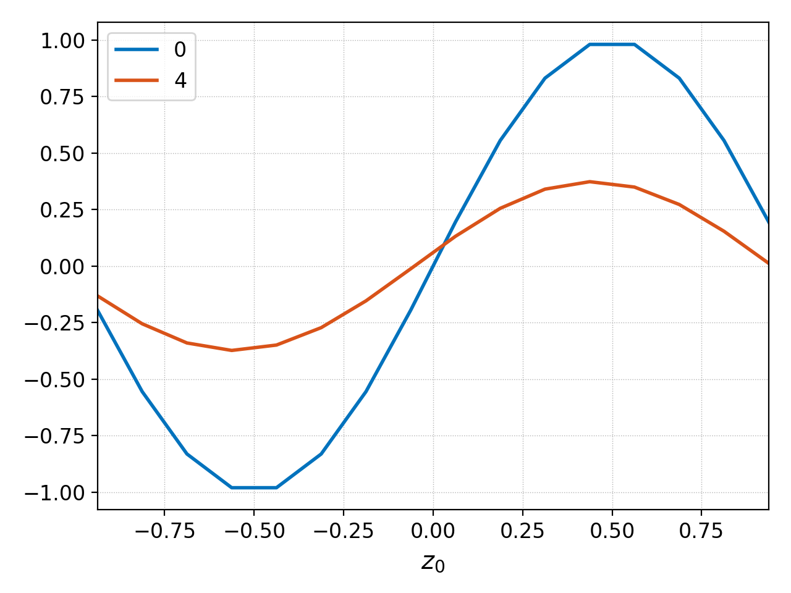
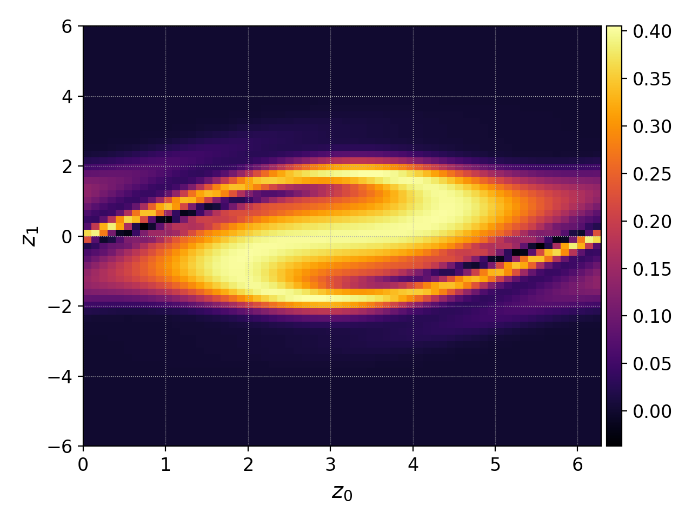

Section 1: Advection-Diffusion Equation
---------------------------------------

.. note::

   `PDF of Notes of Advection-Diffusion Equation
   <./_static/advection-diffusion.pdf>`_. 

   This is a work in progress and I will update them as we go along in
   this part of the course.

   The `homework for this part of the course
   <./_static/hw-advection-diffusion.pdf>`_.  is posted. This is due
   *Thursday March 13th 2025*. Ideally, write the solution usig
   LaTeX. You can simply copy the homework LaTeX files checked into
   the `Github repo
   <https://github.com/ammarhakim/ast560-2025/tree/main/notes/advection-diffusion>`_
   and used that as a starting point. Freely copy the LaTex from the
   notes at the same Github directory also.

   There is a small programming problem (see below) which you also
   need to complete, due *Tuesday March 18th 2025*

.. contents::

Overview
++++++++

The first equation we will study in detail is the advection-diffusion
equation. 

.. math::

   \frac{\partial f}{\partial t}
   + \nabla \cdot (\mathbf{u}f)
   =
   \nabla \cdot (\alpha \nabla f )

Here :math:`f(\mathbf{x},t)` is a (passive) scalar quantity,
:math:`\mathbf{u}(\mathbf{x},t)` and :math:`\alpha(\mathbf{x},t)` are
the (given) advection velocity and diffusion coefficient respectively.

This equation already contains the key features that arise in more
complex systems and so is a good model to look at carefully. In this
part of the course we will see how to build a finite-difference solver
to evolve :math:`f(\mathbf{x},t)` in a given flow-field. We will use
this solver to understand the properties of the discrete scheme and to
look at some interesting flows.

Programming Problem
++++++++++++++++++++

.. note::

 The plots need be made with the Postgkyl tool. Please see
 `documentation 
 <https://gkeyll.readthedocs.io/en/latest/postgkyl/main.html>`_. Postgkyl
 has extensive in-built help (which is probably more up-to-date). For
 example, you can get help by typing::

   pgkyl --help

 And get help for a specific command, for example, `plot` by typing::

   pgkyl plot --help

 Please ask Grant Johnson, Max Rosen and Kolter Bradshaw for help with
 this. (Of course you can just ask me also).

In this problem you complete two functions in code I have
provided. This code solves the advection-diffusion equation using the
schemes developed in class. The code is in the `code` directory and
you need to build it (after building `gminus`)::

  cd code/advection-diffusion/  
  make

Almost all of the code is completed. The solver is in two files,
`adiff.h` and `adiff.c`. The first of this is the header file that
defines the interface to the solver and the second the C
implementation. There also 5 input files::

  sim-1d-gauss.c  sim-1d-sin.c  sim-2d-rotflow.c
  sim-vlasov-cos-pot.c  sim-vlasov-shm-pot.c

These contain the code for running various problems. The `make`
command above will compile all these files.

Once you compile the code you can run the simulations. For example::

  ./sim-1d-sin

This will create some output files::

    sim-1d-sin_diag.gkyl  sim-1d-sin_f_1.gkyl  sim-1d-sin_f_3.gkyl  sim-1d-sin_vel_0.gkyl
    sim-1d-sin_f_0.gkyl   sim-1d-sin_f_2.gkyl  sim-1d-sin_f_4.gkyl

These files contain the solution at different time frames, the
intergated diagnostics and the velocity field. 

You can plot the solutions using Postgkyl. For example, to compare
the initial condition and final solution do::

  pgkyl sim-1d-sin_f_0.gkyl sim-1d-sin_f_4.gkyl plot -f0

This command loads the files `sim-1d-sin_f_0.gkyl` and
`sim-1d-sin_f_4.gkyl` and sends them to the plot command. As we want
to compare the solutions, we use the `-f0` option to plot the
solutions on the same figure. This should produce the following plot.

  Initial (blue) and final (orange) solution for linear
  advection-diffusion for a single mode :math:`\sin(x)`.

Another example. If you run::

 ./sim-vlasov-cos-pot

This will produce a bunch of files with solution at various times. You
can plot the final solution using the Postgkyl command::

 pgkyl sim-vlasov-cos-pot_f_16.gkyl pl

This command loads the data in `sim-vlasov-cos-pot_f_16.gkyl` and
passes it to the `plot` command (note the command name can be
abbreviated and does not need to be spelled out).

This should produce the following 

  Distribution function at :math:`t = 3` for particles in a
  :math:`\cos(x)` potential well. Notice some of the particles are
  *trapped* in the potential, and others are passing particles.

If you want to make an animation, you run the following command::

 pgkyl "sim-vlasov-cos-pot_f_[0-9]*.gkyl" anim

This command loads all the solution files (the wild-card tells
Postgkyl to read all files that match the wildcard pattern0 and the
`anim` command plots the solution.

In this problem you have to complete the following two functions in
`adiff.c`.

.. code:: C

    // Third-order upwind
    static inline double
    calc_flux_upwind_3o(double vel, double fll, double fl, double fr, double frr)
    {
      // HOMEWORK: You need to implement this function!
      fprintf(stderr, "**** HOMEWORK!!!\n"); // delete this line
      assert(false); // delete this line
      return 0.0;
    }

    // Fourth-order central
    static inline double
    calc_diff2_central_4o(double dx, double fll, double fl, double f0, double fr, double frr)
    {
      // HOMEWORK: You need to implement this function!
      assert(false); // delete this line
      return 0.0;
    }

These two functions will be used when you change the scheme type in
the input files

.. code:: C

    .scheme = SCHEME_U3_C4,

This will call your functions instead of the ones already
provided. 

**Your task is to run all the simulations with this option**. Please
remember that you may have to reduce the time-step to get a stable
solution. For this, play around with the `cfl_frac` parameter by
reducing it, for example,

.. code::

    .cfl_frac = 0.4,

Compare the solutions obtained with your flux and stencil with the
ones already provided. Make some comments on the quality of solution,
if it improves or not, for example.
